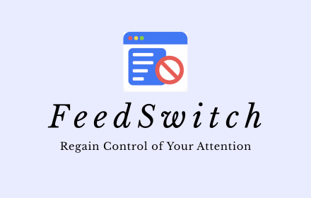
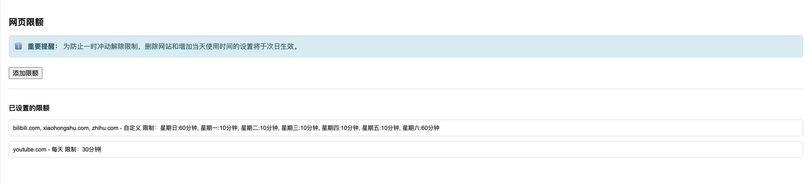

<div align="center">
  <a href="./README.md">中文</a> / <a href="./README_en.md">English</a>
</div>

<p align="center">
  
</p>

# FeedSwitch

FeedSwitch is a Chrome extension that reduces distractions from feeds and recommendations, helping you give your time and attention back to the things that matter. It combines feed blocking, time tracking, and usage limits in one lightweight tool: turn focus on when you need it and restore feeds when you take a break.

## What you can do with FeedSwitch

- **Focus / Fun mode**: Switch with one click. Focus mode hides feeds and recommendation areas on supported websites; Fun mode restores them.
- **Track website usage**: Review usage by website, date, and time of day, with focus time separated from fun time.
- **Set website limits**: Set daily or weekday-specific limits so “I will scroll less” becomes a concrete rule.
- **Delayed changes**: Removing a limit or increasing today’s available time takes effect the next day, helping prevent impulsive overrides.
- **Quick controls and search**: Switch modes, search recorded websites, and pin frequently used websites from the toolbar popup.
- **Local storage**: Your data stays in the browser. No account or upload of browsing history is required.

> FeedSwitch helps you manage attention; it does not try to ban the web. Configure rules around your own work, study, and break schedule.

## Quick Start

### 1. Install dependencies and build

Install Node.js (22 LTS recommended, including npm), Git, and Google Chrome. Then run:

```bash
git clone https://github.com/dsd2077/FeedSwitch.git
cd FeedSwitch
npm ci
npm run build
```

`npm ci` installs dependencies from `package-lock.json`. `npm run build` compiles the content script with Vite and generates `dist/content.js`.

### 2. Load the extension in Chrome

1. Open `chrome://extensions/` in Chrome.
2. Enable **Developer mode** in the top-right corner.
3. Click **Load unpacked**.
4. Select the **FeedSwitch project root** containing `manifest.json`; do not select only `dist/`.
5. Open a supported website and click the FeedSwitch icon in the toolbar.

After changing code, run `npm run build`, click the extension’s reload button on the extensions page, and refresh the target webpage.

### 3. First steps

1. Turn on **Focus** in the popup to hide feeds and recommendations on supported websites.
2. Review the website list, expand an entry for page details, or use the search box to find a site.
3. Open settings, go to **Webpage Limits**, add a domain, and set a daily or weekday-specific limit.
4. Open **Statistic** to review weekly and daily usage.
5. Configure a shortcut for `toggle-tracking` at `chrome://extensions/shortcuts` if needed.

<p align="center">
  
</p>

## See the interface

### Popup: review today’s usage

The popup lists total time by website and uses progress bars to separate focus time from fun time. Click a website to inspect subdomains and pages; use the pin button to keep frequently used sites at the top.

### Statistics: understand your time distribution

The statistics page provides weekly and daily views with total time, average time, per-website usage, and the split between focus and fun time. Data is stored locally by date.

<p align="center">
  
</p>

### Limits: set boundaries in advance

In **Webpage Limits**, add a domain and choose a daily limit or separate limits for each day of the week. Removing a limit, deleting a website, or increasing today’s time takes effect the next day.

<p align="center">
  
</p>

## Supported scope

FeedSwitch includes rules for feeds, recommendation areas, and distracting elements on a range of popular Chinese and international websites. See [Supported Websites and Blocked Content](./SUPPORTED_SITES_en.md) for the full list and each rule’s scope.

Website layouts change over time. If a rule stops working, open an [Issue](https://github.com/dsd2077/FeedSwitch/issues) with the website, page URL, and reproduction steps.

## Development and packaging

Run these commands from the project root:

```bash
# One-time build
npm run build

# Rebuild automatically while editing the content script
npm run watch

# Build and create a Chrome extension archive
npm run create-zip
```

`npm run create-zip` builds first and then creates `feedSwitch-extension.zip`. The packaging script requires the system `zip` command. Before publishing or uploading, make sure `manifest.json` is at the archive root.

## FAQ

**Why does nothing change after loading the extension?** Make sure you selected the project root containing `manifest.json` and the generated `dist/content.js`. Reload the extension at `chrome://extensions/`, then refresh the webpage.

**Why did removing a limit or increasing today’s time not take effect immediately?** This is intentional. Removing a limit or increasing today’s usage time takes effect the next day; the current day’s restriction is not weakened temporarily.

**Why is a website not being blocked?** Feed blocking runs only for websites and pages with configured rules. Check the [supported list](./SUPPORTED_SITES_en.md), or open an Issue if the website is missing.

**Is data uploaded to a server?** No. Usage time, limits, and mode state are stored in Chrome’s local extension storage.

## Notes

- Website redesigns may temporarily affect individual rules.
- Focus mode changes parts of a website’s default layout; switch to Fun mode to restore feeds.
- The extension needs access to page content to identify and hide target areas.

## Related documents

- [Supported Websites and Blocked Content](./SUPPORTED_SITES_en.md)
- [Delayed Changes Summary](./DELAYED_CHANGES_SUMMARY.md)
- [中文 README](./README.md)

---

FeedSwitch helps you reduce unconscious scrolling and keep your attention on the things you choose.
